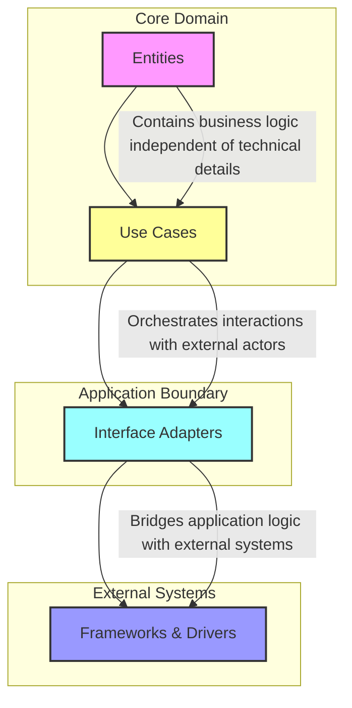

### Introduction à la Clean Architecture 

La **Clean Architecture**, popularisée par Robert C. Martin (Uncle Bob), est une approche qui vise à organiser le code d'une application pour maximiser sa **maintenabilité**, sa **testabilité** et son **évolutivité**. Elle repose sur des principes de séparation des préoccupations en couches distinctes, permettant de rendre les différents aspects de l'application indépendants les uns des autres. Cette architecture est particulièrement adaptée aux projets complexes, où les interactions entre la logique métier, l'interface utilisateur et les systèmes externes doivent être bien structurées.

---


### Objectifs principaux de la Clean Architecture

1. **Indépendance des frameworks** : 
   - L'architecture n'est pas liée à un framework ou une technologie spécifique. Ils deviennent des outils interchangeables.

2. **Facilité de test** :
   - En séparant la logique métier des détails techniques, les tests unitaires sont plus simples à écrire et à maintenir.

3. **Indépendance des interfaces utilisateur** :
   - La logique métier n'est pas affectée par les changements dans l'interface utilisateur ou le système de présentation.

4. **Indépendance des bases de données** :
   - La persistance des données est un détail technique qui n’impacte pas la logique métier.

5. **Indépendance des systèmes externes** :
   - Les intégrations avec des APIs tierces ou des systèmes externes sont isolées et peuvent être facilement modifiées ou remplacées.



---

### Structure en couches

La Clean Architecture est généralement représentée par des cercles concentriques, chaque couche ayant une responsabilité claire :

1. **Entités** :
   - Représentent les modèles métier fondamentaux.
   - Contiennent les règles métier universelles qui ne dépendent d'aucun détail technique.

2. **Cas d’utilisation (Use Cases)** :
   - Contiennent la logique métier spécifique à l’application.
   - Décrivent les interactions possibles entre les entités et les acteurs externes.

3. **Interface d’adaptation (Interface Adapters)** :
   - Gèrent les conversions entre les cas d'utilisation et les systèmes externes (UI, base de données, APIs, etc.).

4. **Frameworks et drivers** :
   - Contiennent les détails d’implémentation technique : frameworks, bibliothèques, interfaces utilisateur, bases de données.

---

### Les Principes Sous-Jacents

La Clean Architecture s’appuie sur plusieurs principes fondamentaux de développement logiciel, dont :

1. **SOLID** :
   - Chaque classe ou module respecte les principes SOLID pour garantir un code modulaire, réutilisable et robuste.

2. **Dépendance inversée** :
   - Les couches internes (logique métier) ne dépendent jamais des couches externes (frameworks ou bases de données). Les dépendances pointent toujours vers l'intérieur.
  

```js
// logiquue métier 
export interface UserRepository {
  getUser(id: string): string;
}

export class GetUserUseCase {
  constructor(private repo: UserRepository) {}
  execute(id: string): string {
    return this.repo.getUser(id);
  }
}

// implémentation externe remplaçable facilement par une API par exemple
export class DatabaseUserRepository implements UserRepository {
  getUser(id: string): string {
    return `User ${id} from DB`;
  }
}

// point d'entrée
const useCase = new GetUserUseCase(new DatabaseUserRepository());
console.log(useCase.execute("1")); // Output: User 1 from DB
```


1. **Separation of Concerns** :
   - Chaque couche se concentre sur une responsabilité unique.

---

### Pourquoi adopter la Clean Architecture ?

1. **Longévité du projet** : 
   - Une application bien structurée est plus facile à maintenir et à adapter aux besoins changeants.

2. **Équipe modulable** :
   - Les développeurs peuvent travailler indépendamment sur différentes couches sans interférer.

3. **Facilité de migration technologique** :
   - L’indépendance des détails techniques permet de changer un framework ou une base de données sans affecter le reste du code.

---

### Exemple avec en TypeScript et React

#### Exemple 1 : Gestion d'utilisateurs avec une architecture propre

####  React et Redux Toolkit

Pour une application de gestion de tâches, voici un exemple structuré :

- **Entités**  
  Chaque tâche est représentée par un objet `Task`.

  ```ts
  interface Task {
      id: string;
      title: string;
      completed: boolean;
  }
  ```

- **Cas d'utilisation**  
  La gestion des tâches est centralisée dans un `slice` Redux.  

  ```ts
  import { createSlice, PayloadAction } from '@reduxjs/toolkit';

  const tasksSlice = createSlice({
      name: 'tasks',
      initialState: [] as Task[],
      reducers: {
          addTask(state, action: PayloadAction<{ title: string }>) {
              const newTask: Task = {
                  id: Math.random().toString(36).substr(2, 9),
                  title: action.payload.title,
                  completed: false,
              };
              state.push(newTask);
          },
          toggleTask(state, action: PayloadAction<{ id: string }>) {
              const task = state.find(t => t.id === action.payload.id);
              if (task) task.completed = !task.completed;
          },
      },
  });

  export const { addTask, toggleTask } = tasksSlice.actions;
  export default tasksSlice.reducer;
  ```

- **Adaptateurs d’interface**  
  Une interface utilisateur avec des composants React connectés à Redux.

  ```tsx
  import React from 'react';
  import { useSelector, useDispatch } from 'react-redux';
  import { RootState } from './store';
  import { addTask, toggleTask } from './tasksSlice';

  const TasksList = () => {
      const tasks = useSelector((state: RootState) => state.tasks);
      const dispatch = useDispatch();

      const handleAddTask = (title: string) => {
          dispatch(addTask({ title }));
      };

      const handleToggleTask = (id: string) => {
          dispatch(toggleTask({ id }));
      };

      return (
          <div>
              <ul>
                  {tasks.map(task => (
                      <li key={task.id} onClick={() => handleToggleTask(task.id)}>
                          {task.title} {task.completed ? "✔️" : "❌"}
                      </li>
                  ))}
              </ul>
              <button onClick={() => handleAddTask("New Task")}>Add Task</button>
          </div>
      );
  };

  export default TasksList;
  ```

---

### **1. Entités**
**Responsabilité :**  
Les entités sont les objets centraux qui modélisent les données et règles métier de base.

### **2. Cas d'utilisation**
**Responsabilité :**  
Gère les règles spécifiques liées à la manipulation des entités et leur utilisation.

### **3. Adaptateurs d'interface**
**Responsabilité :**  
Connecte l'utilisateur final avec la logique métier via des composants React.

- **Position dans la Clean Architecture :** Couche **Interface utilisateur**.  
- **Rôle :** Fournit une interface pour afficher et interagir avec les données.

---

### **Relations avec la Clean Architecture :**

1. **Dépendance inversée**  
   Les composants React n'interagissent pas directement avec les données ; ils passent par le slice Redux.

2. **Separation of Concerns**  
   - **Entités** : définissent ce qu'est une tâche.  
   - **Cas d'utilisation** : implémentent la logique métier pour manipuler les tâches.  
   - **Interface utilisateur** : affiche les tâches et capte les interactions utilisateur.

### **Schéma Clean Architecture**


**Résumé :**  
- Les **Entités** définissent la structure des données.  
- Les **Cas d'utilisation** contrôlent les règles métier.  
- Les **Adaptateurs d'interface** connectent ces couches au monde extérieur.
